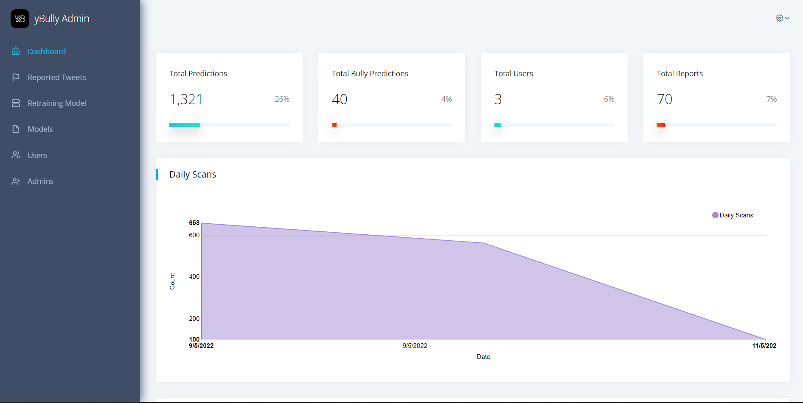
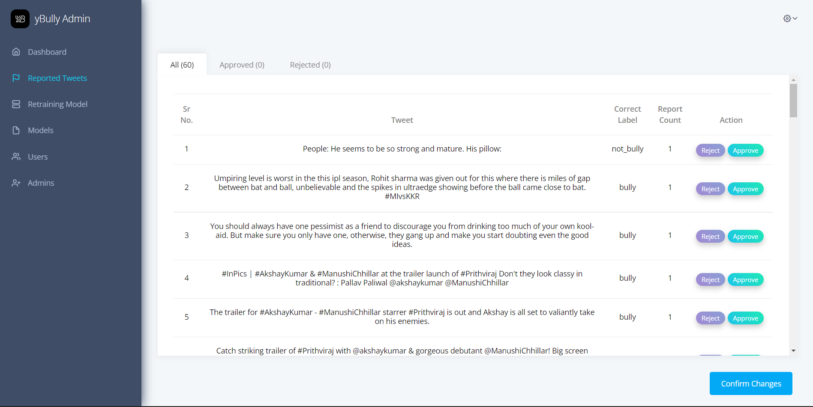
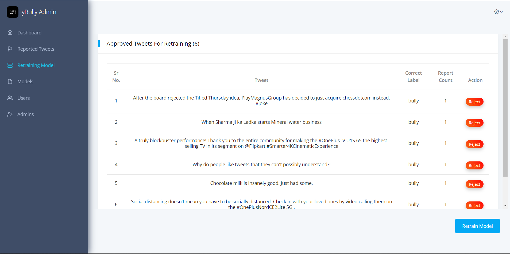
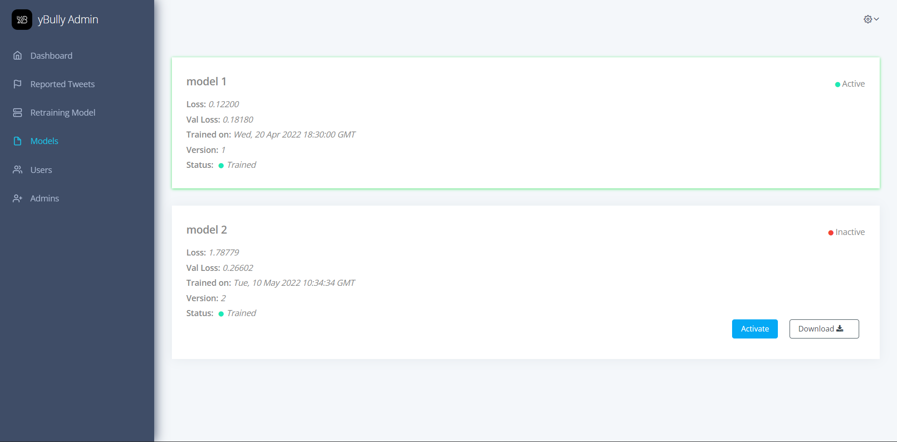
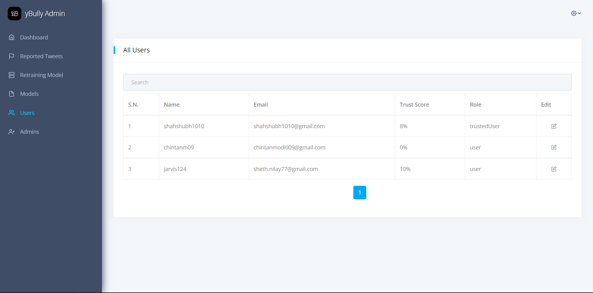
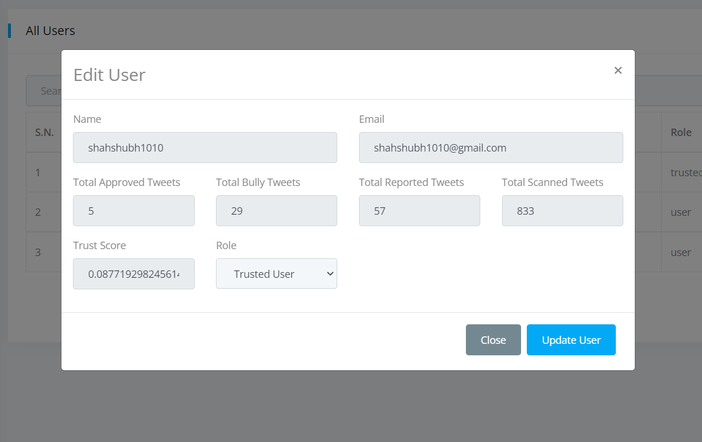
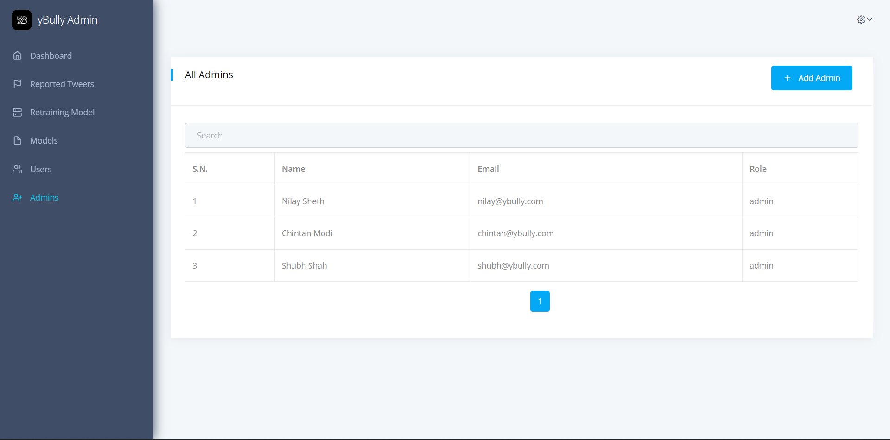

 <div align="center">


yBully Admin
==========

[](https://reactjs.org/docs/getting-started.html)
[](https://firebase.google.com/docs)
[](https://code.visualstudio.com/ "Visual Studio Code")


</div>

Table of contents
-----------------

* [Introduction](#introduction)
* [Features](#features)
* [Demo](#demo)
* [Installation](#installation)
* [Contributing](#contributing)
* [License](#license)


Introduction
-------------

yBully Admin is a ReactJS based admin dashboard application for yBully Chrome Extension that allows you to manage users, stats, and more.


Features
---------

* View Detailed Statistics.
* View Graphical Statistics.
* View List of Reported Tweets.
* Approve / Reject Tweets Reported by Users.
* View List of Approved Tweets.
* Retrain the Model using the list of Approved Tweets.
* Manage Users.
* Manage Admins.
* Manage Trained / Active Models.


Demo
-----

<div align="center">
    <h4 align="center">Dashboard Page</h4>
    
    <h4 align="center">Reported Tweets Page</h4>
    
    <h4 align="center">Retraining Model Page</h4>
    
    <h4 align="center">All Models</h4>
    
    <h4 align="center">All Users Page</h4>
    
    <h4 align="center">User Details / Edit User</h4>
    
    <h4 align="center">All Admins Page</h4>
    
</div>

<br />


Installation
-------------

Before starting with installation you would require to setup a [firebase project](https://firebase.google.com/).

Once the firebase project is ready, follow below steps.

1. Clone this repository `git clone https://github.com/yBullyy/yBully-admin.git`.
2. Change directory `cd yBully-admin`.
3. Create .env file in root directory.
4. Add the following lines to .env file.

```
REACT_APP_FIREBASE_API_KEY=<your-firebase-api-key>
REACT_APP_FIREBASE_AUTH_DOMAIN=<your-firebase-auth-domain>
REACT_APP_FIREBASE_DATABASE_URL=<your-firebase-database-url>
REACT_APP_FIREBASE_PROJECT_ID=<your-firebase-project-id>
REACT_APP_FIREBASE_STORAGE_BUCKET=<your-firebase-storage-bucket>
REACT_APP_FIREBASE_MESSAGING_SENDER_ID=<your-firebase-messaging-sender-id>
REACT_APP_FIREBASE_APP_ID=<your-firebase-app-id>
REACT_APP_FIREBASE_MEASUREMENT_ID=<your-firebase-measurement-id>
```

5. Run `npm install` to install all the required dependencies.
6. Run `npm start` to start the server.
7. Open the browser and go to `http://localhost:3000/`.
8. Create a new user from firebase console.
9. Login with those credentials & you will be redirected to the admin dashboard.


License
--------

[](https://github.com/yBullyy/yBully-admin/blob/master/LICENSE)


Stargazers
-----------
[](https://github.com/yBullyy/yBully-admin/stargazers)


<br/>
<p align="center"><a href="https://github.com/yBullyy/yBully-admin#"></a></p>